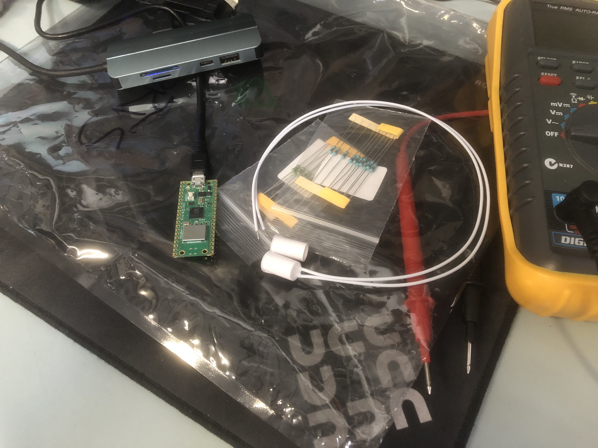

The UCC has recently set up [a door
sensor](https://gitlab.ucc.asn.au/UCC/ucc-door-sensor) - a Raspberry
PicoW and reed switch, talking MQTT to a backend VM - but we'll be
wanting more soon, and perhaps other types of input/output.
<!--more-->

---

The Saturday afternoon workshop was to work with the Raspberry PicoW to reproduce and extend an existing project that is [hosted](https://gitlab.ucc.asn.au/UCC/ucc-door-sensor) on UCC's Gitlab server.

Access to the UCC was by telephoning the club room to be let in downstairs which went smoothly.
 
 Nick suggested that we could either build the design, which meant connecting the reed-switch and several resistors to the board-edge holes, or work on installing the project software into the Pico. After testing the read-switch with a multimeter we decided to use our two hours to work on the software aspects of the project.

Nick had provided a Raspberry PicoW for the workshop and explained how we could obtain one locally or on-line. I came without a laptop but had brought along a debian live thumb drive. UCC has many machines and, after a reboot, I could work without needing a UCC account; just network access.  

The other attendee, Sophia, had her MacBook.

First steps were to identify the USB entries for the Pico when connected to the MacBook and the USB devices that were present. As a freshly purchased Pico it had no application code so it opened the bootloader storage device into which we could drag and drop the CircuitPython uf2 file described in the project README.md. We installed the later stable version CircuitPython 9.1.4 without issue. It took a moment to realise we needed to unplug and replug the Pico to move to CircuitPython.

To prove we had CircuitPython running, I installed picocomm on debian, found the /dev/ttyACM0 console port opened from the Pico, and attached to it to see the Python console prompt; so hello Pico.

The README referred to some handy scripts in the project to set up the application. These would not work on the MacBook so we had to look at the scripts as guidance to do a manual installation. The upstream maintainer had used a Mac with VSCode which Sophia was familiar with and meant the project prepared the Python environment so we had the appropriate libraries to drag on to the Pico.

After discussion about polluting the standard debian installation with python libraries outside of debian, we set up a virtual python environment in order to replicate the files required by the project scripts. This required more research and was completed but we ended up using the MacBook to move the files onto the Pico.

Part of the project instructions required authentication details so Nick, as a UCC member, connected via USB to the live door sensor and obtained those details.

Rather than building the hardware and replacing the door sensor for our test we reconnected to debian and the python console to examine the hardware features via python and run a small python script to run a blinken LED.

Thinking back, I would have been able to work more effectively if I had cloned the project at home or viewed it on the UCC Gitlab web pages prior to coming to the workshop. The PLUG event page had the Gitlab link to make this possible.
 
I will continue to work from a live debian for any UCC events unless configuring the tools is a precursor to the core purpose of the workshop and I need to bring that on a laptop. If I do re-use the live boot approach then I will send the BASH history file via webmail before rebooting. That way I have a record of the session to reference.

Several people at UCC expressed interest in the workshop as we finished up so location on a bus route, reasonable ease of clubroom access, and potential for UCC attendees make this a venue to consider for more events. 

Thank you to Nick for conducting the workshop.
  
