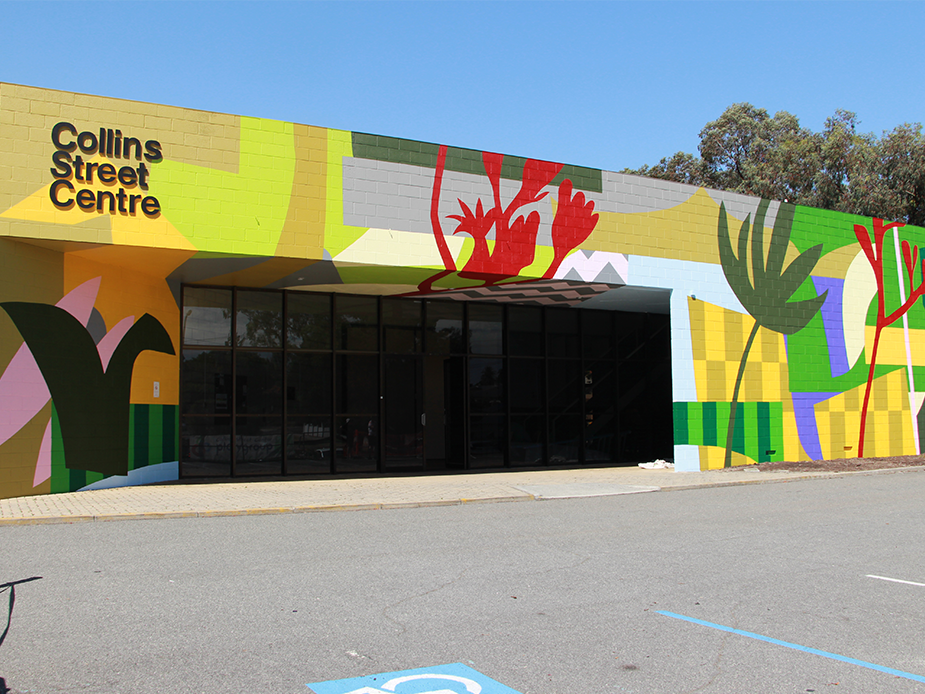

<!--more-->

### When:   Saturday 23 August, 2025 12.30pm until 4.00pm

### Where:  Collins Street Centre, 4 Collins Street, South Perth

### Access: Wheelchair access from upper carpark

### Bus:
 * Canning Highway before Collins Street, Stop 10231 (from Perth)
 * Canning Highway after Cliffe Street,   Stop 10338 (from Fremantle)

### RSVP:

Email [committee@plug.org.au with Subject:Installfest](mailto:committee@plug.org.au?subject=Installfest) and let us know if you are an installee (bringing a computer), attendee (coming to learn more), or PLUG member (coming to observe or assist). Tell us more about a computer you are bringing if you can obtain its make, model, etc. 

### Cost:

JAFWA have kindly offered space for PLUG at their Afternoon event. The JAFWA entry fee is $5 and is the only cost for attending the Installfest.

## Why Installfest ?

PLUG Installfest offers time and assistance to anyone who wishes to learn about Linux for work, education, or interest.

The August 2025 installfest is part of the global EndOf10 initiative. Read more at [https://endof10.org](https://endof10.org)

The essence of the initiative is to reuse any computer presently running Windows10 that is deemed unable to run Windows11. Linux places no restrictions like this and will continue to offer feature upgrades and security updates which are about to cease for Windows10 computers. 

If you are attending as an installee, this page offers some guidance about preparation before the Installfest, what to bring on the day, and what to expect from the day. If you are not an installee then the experience we can offer is to observe the process and learn more about the steps. We list the things to bring along (below) so we can prepare you to install Linux yourself at a later time. Read on to understand what you will need to get the most from the day.

## Before the day

### Copying all of your personal data from Windows10

The EndOf10 page briefly notes: "Before you start, make sure to back up any important data from the computer you're about to reinstall!"

The installation of Linux removes all existing information on the computer data storage disks (hard drive) and replaces it with a fresh copy of Linux. We will ask you to sign a waiver that acknowledges you understand this.  

There are a number of ways to make copies of your data:

- plug in a USB thumb drive or external drive and copy files as backup storage,
- use online storage such as OneDrive, GoogleDrive, Dropbox, etc to copy files as backup storage.

While files in Documents and Download folders are easy to recognise, some other data that may be overlooked are:

- passwords stored by web browsers and email programs,
- other credentials to access networks and other devices,
- bookmarks in web browsers,
- email if you download this onto the computer (very rare now),
- any other software that stores data on your computer.

If you don't care about the data on the computer, the list above is a reminder to consider before installation.

## What to bring

As an installee, you will need all parts of the computer needed to operate normally; the main computer case, screen, cables, keyboard, and mouse.

If you are coming by bus, please let us know in your RSVP email. We may be able to arrange a screen and other parts so you just need to bring the main computer case. 

A laptop is much simpler but do not forget the plug pack and external mouse if you use one.

We will have wireless and wired network access but we encourage you to bring your phone if it has a data plan. If you don't use the phone this way already, we can show you how to connect Linux to your phone wireless hotspot so you can continue exploring Linux at the Installfest and beyond. After learning how to connect to wireless, you will know how to connect to other wireless networks at work, home, or public wireless access.

Even if you are coming along without a computer, we encourage you to bring a USB thumb drive so that you can take away Linux ready to install at a later date. We will have several different Linux versions to try and we can prepare the USB thumb drive from your choice. We can prepare multiple thumb drives if you bring them; Linux is free to install and use. Like the laptop data, copying Linux onto the USB thumb drive will erase all other data on the USB drive. A minimum 8GB thumb drive is required and if it is an old one then it may be a bit slower but it will work well enough. A [new 32GB USB thumb drive](https://www.ple.com.au/products/659054/sandisk-cruzer-glide-32gb-usb-30-type-a-flash-drive) is $9 to $10 so bring a new one if you are unsure. 

It is not essential but we recommend installees also have a Live Boot to start their computer for recovery, for testing without any access to existing data on the hard storage, or to use or demonstrate Linux on other Windows computers. 

## Steps at the Installfest

When you arrive as an installee we will ask you to sign our waiver so we are free to explore and install your preferred Linux. 

### Testing the laptop with Linux before permanently installing Linux

Testing and installation is all provided in a Live Boot USB thumb drive; either PLUG's or your own that we prepare on the day. The live boot feature allows us to run Linux without making any change to the laptop; Windows is not altered in any way. Live Boot allows us to see that the computer is working properly, it allows you to play with the Linux version you have selected. We will assist to connect to the internet and try email and browsing. If you have a printer, scanner, or other devices that you would like to test then the Live Boot is an ideal time to test these before deciding to install Linux.

### Installing Linux

The Live Boot USB has a desktop icon to install Linux onto the hard disk. Please do not use this until you are ready to replace Windows! A small number of questions are asked about the keyboard, language, and location (for time zone) and then the installation proceeds with very little user interaction. Once installed, you are asked to remove the Live Boot USB and allow the computer to reboot from its own data storage runnng Linux instead of Windows.

### Using security updates and installing additional apps

Linux indicates when security updates are available. We will show you how to update your computer. If you are using your phone for network, the first update can be made at the Installfest or after you return home from the day.

Each version of Linux has a set of tools and apps to cover most of the normal computing tasks. The Linux ecosystem contains many additional apps that are part of a secure repository for the version of Linux you have chosen. We can show you how to research other software and how to install it yourself.

### Setting up devices and services

We can assist with setting up services and devices but we recommend describing these as much as you can in your RSVP email to committee@plug.org.au prior to the Installfest. This gives us an opportunity to consider the level of support that Linux offers for your devices.

### Any other questions

We will be able to answer questions as part of the Installfest. Our contact tools such as email lists and online chat (IRC) are available to ask further questions.

         

