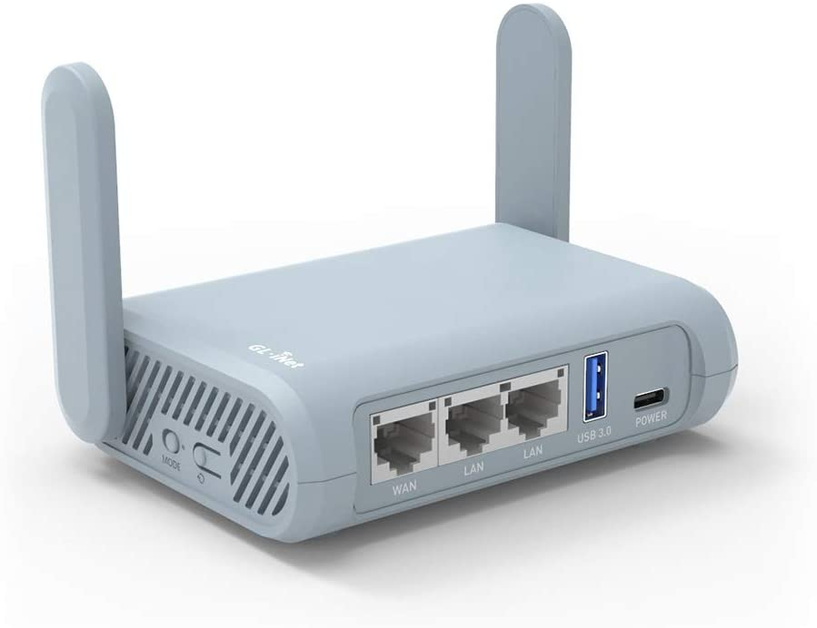

Network hardware forms the backbone of the video streaming setup. The goal of it is to provide a simple solution for consuming an internet connection from whatever is available - WiFi, 4G/5G tethering or an Ethernet internet connection - and turning that connection into a consistent network for PLUG guests + AV hardware.

## Introduction

The network hardware currently consists of a GL.iNet GL-MT1300 "Beryl" WiFi router, running OpenWRT - referred to throughout the rest of this document as "Beryl".

Optionally, an additional switch (nominally an 8-port gigabit switch) can also be connected to **one** of the LAN ports on the Beryl to provide Ethernet networking to one or more wired devices (beyond the two built-in ports), useful for events such as the Raspberry Pi Jams.

## Physical setup

* Unbox the Beryl router and its power adapter. Place it somewhere within WiFi range of clients - usually somewhere in the middle of a room - and within physical range of any necessary Ethernet connections.
* If an Ethernet connection is to be used to connect to the internet, connect an Ethernet cable from the source to the WAN port on the Beryl.
* If a switch is to be connected to the Beryl to provide additional LAN connectivity, connect an Ethernet cable from the switch to one of the two LAN ports on the Beryl. Do not connect more than one cable, as this will cause issues for both the switch and the Beryl router.
* Plug the power adapter into the Beryl, turning it on.

## Viewing the status of the network system

Once the Beryl has been turned on, you'll want to log onto it and see its current status.

### Logging in to the router

* Connect a laptop to the `PLUG-Members` WiFi network (**TODO**: Document the password).
* Using a browser, access the main admin panel (http://10.20.30.1/)
* Log in to the main admin panel using the admin password (**TODO**: Document the password).

You should see the main page, which gives you a view of which network connections are available and in use. In the picture provided, the router is connected to both Ethernet ("Cable") and WiFi ("jamesh-home-5G") upstream networks.

## Upstream network setup

In order to use the network hardware correctly, an upstream internet connection is required. This can consist of any of the following: Ethernet, WiFi, 4G/5G (with an attached USB modem, optional), or tethering from a phone via USB-A to USB-C or Lightning cable. An "upstream" internet connection is simply an internet connection we intend to share with other devices.

### Logging in to the router

* Connect a laptop to the `PLUG-Members` WiFi network (**TODO**: Document the password).
* Using a browser, access the main admin panel (http://10.20.30.1/)
* Log in to the main admin panel using the admin password (**TODO**: Document the password).

### Connecting to an Ethernet network

No special configuration is required for connecting to an Ethernet network - it should "just work" by plugging the cable into the WAN port on the Beryl router. However, in the rare event that special configuration is required - specifically, a static network configuration - you can follow these steps:

* Log into the router
* Under "Cable", click **Modify**.
* Click the dropdown menu, and then select **Static**.
* Fill out the details as needed
* Click Apply.

### Connecting to a WiFi network

* Log into the router
* If Beryl is currently connected to a network:
  * TODO
* If Beryl is not currently connected to a network:
  * Find the "Repeater" 
    

## Connecting AV clients

## Connecting guest clients

## Addendum 1: Backing up and restoring configuration

